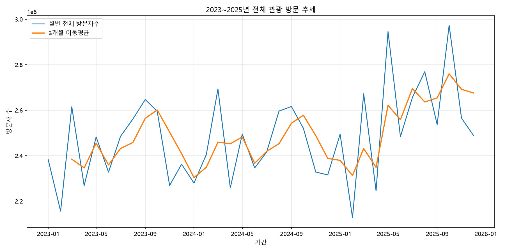
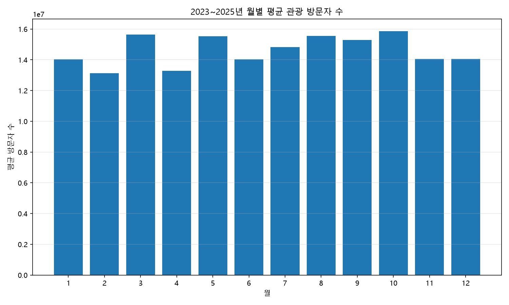
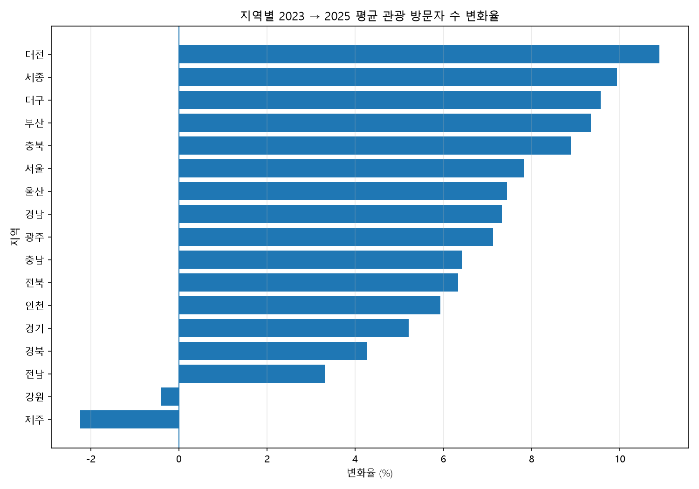
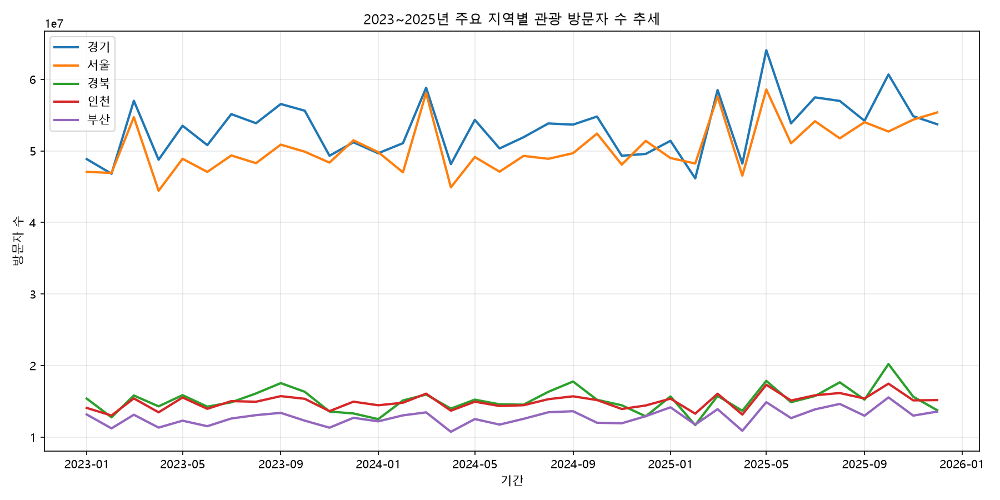
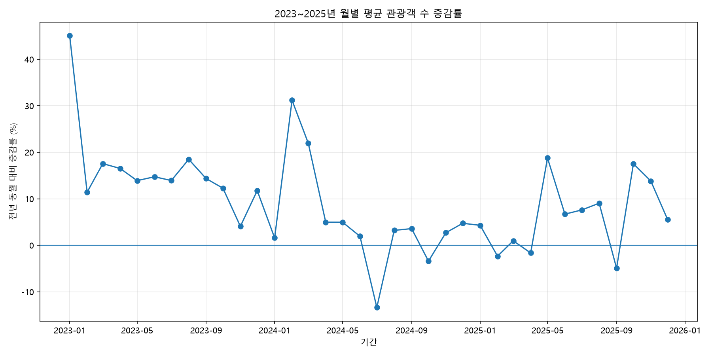
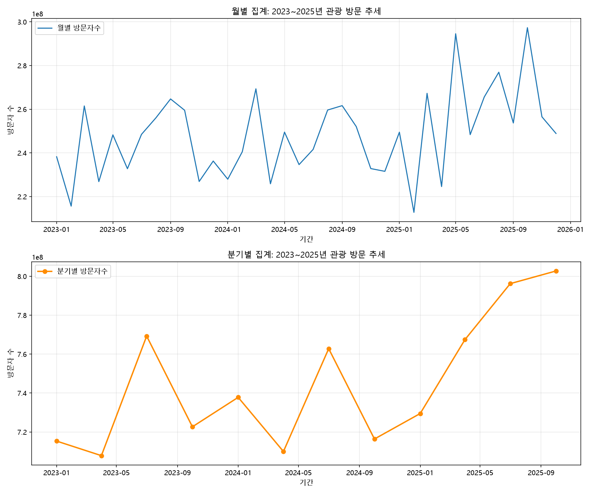
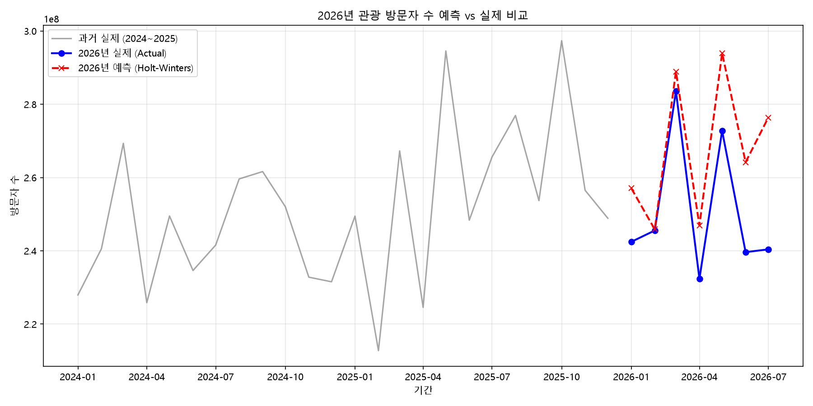

# 지역별 관광 방문자 데이터를 활용한 시계열 트렌드 분석

## 1. 분석 주제

### 2023~2025년 지역별 관광 방문자 수의 시계열 추세와 계절성 분석

본 분석은 2023년 1월부터 2025년 12월까지의 지역별 관광 방문자 데이터를 활용하여 관광 수요의 장기적인 추세와 월별 계절성, 지역별 변화율 및 월별 증감률을 분석하는 것을 목적으로 한다.

또한 본 분석에서 사용한 2023~2025년 데이터를 기준으로 2026년 1월부터 7월까지의 데이터를 별도로 비교하여 최근 관광 방문 흐름이 어떻게 변화하고 있는지 확인하였다.

---

## 2. 분석 질문

본 분석에서는 다음과 같은 질문에 답하고자 한다.

1. 2023~2025년 관광 방문자 수는 전체적으로 증가 또는 감소하는 추세를 보이는가?
2. 관광 방문자 수에는 특정 월에 반복적으로 나타나는 계절성이 존재하는가?
3. 2023년과 2025년 사이 지역별 관광 방문자 수 변화에는 어떤 차이가 있는가?
4. 주요 관광 지역의 방문자 규모와 증가율은 어떤 차이를 보이는가?
5. 월별 전년 대비 방문자 수 증감률은 일정한 패턴을 보이는가?
6. 2026년 1~7월 관광 방문자 수는 2025년 같은 기간과 비교하여 어떤 변화가 나타났는가?

---

## 3. 데이터 설명

### 3.1 데이터 개요

분석에 사용한 주요 데이터는 한국관광 데이터랩의 지역별 관광 현황 데이터를 기반으로 구성하였다.

주요 변수는 다음과 같다.

| 변수 | 설명 |
|---|---|
| 기준년월 | 관광 방문자 수가 집계된 연월 |
| 지역 | 전국 17개 시·도 |
| 방문자수 | 해당 지역의 관광 방문자 수 |
| 전년동월방문자수 | 전년 같은 달의 관광 방문자 수 |
| 방문자수증감률 | 전년 동월 대비 방문자 수 증감률 |

본 분석의 주요 시계열 데이터는 2023년 1월부터 2025년 12월까지이며, 총 17개 지역 × 36개월 = 612개 관측값으로 구성되어 있다.

2026년 1월~7월 데이터는 17개 지역 × 7개월 = 119개 관측값이다. 다만 광주와 전남의 2026년 7월 방문자 수는 원본 데이터에서 0으로 제공되었으나, 실제 방문자 수가 아닌 자료 미제공에 따른 값으로 확인되었다. 따라서 2025년 대비 증감률 비교에서는 해당 데이터를 결측값으로 처리하여 제외하였으며, 지역별 비교에는 117개의 유효 관측값을 사용하였다.

### 3.2 데이터 전처리

지역별로 분리되어 있던 2026년 CSV 파일 17개를 하나의 CSV 파일로 통합하였다.

2026년 원본 파일에는 `지역` 변수가 포함되어 있지 않았기 때문에 각 파일명을 이용하여 지역명을 추가하였다.

예를 들어 `2026(서울).csv`는 `지역 = 서울`로 변환하였다.

통합 결과:

- 지역 수: 17개
- 기간: 2026년 1월~7월
- 총 데이터 수: 119개

또한 2026년 7월 광주와 전남의 방문자수는 0으로 제공되었으나, 이는 실제 방문자 수가 0명이라는 의미가 아니라 전남광주통합특별시 출범에 따른 자료 미제공에 의한 값이다. 따라서 2026년 비교 분석에서는 해당 두 지역의 7월 데이터를 결측으로 취급하였다.

---

## 4. 분석 방법

본 분석에서는 다음과 같은 시계열 분석 방법을 활용하였다.

### 4.1 월별 전체 방문자 수 추세

각 월의 17개 지역 방문자 수를 합산하여 전체 관광 방문자 규모의 월별 추세를 확인하였다.

### 4.2 이동평균

단기적인 월별 변동을 완화하고 장기적인 추세를 확인하기 위해 3개월 이동평균을 계산하였다.

### 4.3 월별 계절성 분석

2023~2025년의 동일한 월을 묶어 월별 평균 방문자 수를 계산하였다.

이를 통해 특정 월에 관광 방문자가 반복적으로 증가하거나 감소하는지를 확인하였다.

### 4.4 지역별 변화율 분석

각 지역의 2023년 월평균 방문자 수와 2025년 월평균 방문자 수를 비교하여 다음과 같이 변화율을 계산하였다.

변화율(%) =
(2025년 평균 - 2023년 평균) / 2023년 평균 × 100

### 4.5 월별 전년 대비 증감률 분석

각 연도의 월별 `방문자수증감률`을 활용하여 관광 방문자 수의 단기적인 증가 및 감소 폭을 분석하였다.

---

# 5. 시각화

## 5.1 2023~2025년 전체 관광 방문 추세



2023년부터 2025년까지 17개 지역의 월별 방문자 수를 합산하고 3개월 이동평균을 함께 나타냈다.

월별 방문자 수는 지속적으로 등락했지만 장기적인 흐름에서는 증가하는 모습을 확인할 수 있었다.

---

## 5.2 2023~2025년 월별 평균 관광 방문자 수



2023~2025년의 동일한 월을 기준으로 평균 방문자 수를 계산하여 월별 계절성을 확인하였다.

---

## 5.3 지역별 2023 → 2025 평균 관광 방문자 수 변화율



각 지역의 2023년과 2025년 월평균 방문자 수를 비교하여 지역별 변화율을 나타냈다.

---

## 5.4 2023~2025년 주요 지역별 관광 방문자 수 추세



관광 방문자 규모가 큰 경기, 서울, 경북, 인천, 부산의 월별 방문자 수 변화를 비교하였다.

---

## 5.5 2023~2025년 월별 평균 방문자 수 증감률



월별 전년 대비 방문자 수 증감률의 평균을 이용하여 월별 증가 및 감소 패턴을 확인하였다.

---

# 6. 분석 결과 및 인사이트

## 인사이트 1. 전체 관광 방문자 수는 장기적으로 증가하는 추세를 보였다.

### 관찰

17개 지역의 연간 방문자 수를 합산한 결과,

- 2023년: 약 29.15억 명
- 2024년: 약 29.27억 명
- 2025년: 약 30.96억 명

으로 나타났다.

2024년은 2023년 대비 약 0.41% 증가했지만, 2025년에는 2024년 대비 약 5.77% 증가하였다.

또한 3개월 이동평균은 2023년 3월 약 2.38억 명에서 2025년 12월 약 2.68억 명으로 약 12.2% 높아졌다.

### 해석

월별 방문자 수는 단기적으로 등락을 반복하지만, 이동평균과 연간 누적 방문자 수를 함께 보면 2023~2025년 관광 방문 규모는 전반적으로 증가하는 장기 추세를 보였다고 판단할 수 있다.

다만 본 데이터만으로 증가 원인을 특정할 수는 없으므로 정책, 경기, 행사 등의 원인으로 직접 해석하지 않았다.

---

## 인사이트 2. 관광 방문자 수에는 뚜렷한 월별 계절성이 나타났다.

### 관찰

2023~2025년 17개 지역의 월별 평균 방문자 수를 비교한 결과,

- 가장 높은 달: 10월 약 1,586만 명
- 가장 낮은 달: 2월 약 1,312만 명

으로 나타났다.

10월의 평균 방문자 수는 2월보다 약 20.9% 높았다.

그 외에도 3월, 5월 및 8~10월에는 상대적으로 높은 방문자 수가 나타났으며, 1~2월과 4월에는 상대적으로 낮은 수준을 보였다.

### 해석

관광 방문자 수에는 일정한 월별 계절성이 존재하는 것으로 볼 수 있다.

따라서 관광 수요를 분석하거나 관련 서비스를 계획할 때 연간 평균만 사용하는 것보다 월별 계절 패턴을 함께 고려할 필요가 있다.

다만 본 데이터에는 날씨, 연휴, 축제 등의 외부 요인이 포함되어 있지 않으므로 특정 월의 증가 원인을 단정할 수 없다.

---

## 인사이트 3. 대부분의 지역에서 2023년보다 2025년 평균 방문자 수가 증가했다.

### 관찰

2023년과 2025년의 지역별 월평균 방문자 수를 비교한 결과, 17개 지역 중 15개 지역에서 방문자 수가 증가하였다.

증가율이 높은 지역과 감소한 지역은 다음과 같다.

| 지역 | 2023 → 2025 변화율 |
|---|---:|
| 대전 | +10.90% |
| 세종 | +9.94% |
| 대구 | +9.56% |
| 부산 | +9.35% |
| 충북 | +8.89% |
| 강원 | -0.40% |
| 제주 | -2.24% |

### 해석

전체 관광 방문자 수가 증가하는 가운데서도 지역별 증가 정도에는 차이가 있었다.

특히 대전, 세종, 대구, 부산 등의 증가율이 상대적으로 높았으며, 강원과 제주는 2023년 대비 2025년 평균 방문자 수가 감소하였다.

따라서 전국 단위의 관광 증가 추세만으로 지역별 관광 흐름을 동일하게 설명하기는 어렵다.

---

## 인사이트 4. 방문자 규모가 큰 지역과 증가율이 높은 지역은 반드시 일치하지 않았다.

### 관찰

2025년 월평균 방문자 수는 다음과 같았다.

| 지역 | 2025년 월평균 방문자 수 |
|---|---:|
| 경기 | 약 5,500만 명 |
| 서울 | 약 5,277만 명 |
| 경북 | 약 1,565만 명 |
| 인천 | 약 1,546만 명 |
| 부산 | 약 1,349만 명 |

절대적인 방문자 규모는 경기와 서울이 가장 컸다.

그러나 2023년 대비 2025년 증가율은 부산이 +9.35%로 경기(+5.21%)보다 높았다.

서울 역시 +7.84%로 경기보다 높은 증가율을 보였다.

### 해석

관광객 규모가 큰 지역이 반드시 가장 빠르게 성장하는 것은 아니다.

따라서 지역 관광 데이터를 평가할 때는 전체 방문자 규모와 증가율을 별도의 지표로 함께 확인할 필요가 있다.

---

## 인사이트 5. 월별 평균 방문자 수 증감률은 일정하지 않고 변동성이 나타났다.

### 관찰

2023~2025년 동일 월의 평균 방문자 수 증감률을 계산한 결과,

- 1월: +16.98%
- 2월: +13.42%
- 3월: +13.48%
- 7월: +2.72%
- 9월: +4.33%
- 10월: +8.80%

등으로 월별 차이가 나타났다.

개별 연월 중 가장 높은 증감률은 2023년 1월의 +45.05%였으며, 가장 낮은 값은 2024년 7월의 -13.36%였다.

### 해석

장기적으로 방문자 수가 증가하더라도 매월 동일한 속도로 증가하는 것은 아니다.

따라서 관광 수요를 예측하거나 운영 계획을 수립할 때 장기적인 증가 추세와 함께 단기적인 변동성도 고려할 필요가 있다.

---

# 7. 2026년 별도 비교 분석

## 7.1 분석 목적

2023~2025년의 장기적인 관광 방문 추세를 분석한 후, 최근 데이터인 2026년 1~7월의 방문자 수를 2025년 같은 기간과 비교하여 최근 관광 흐름을 확인하였다.

2026년 데이터는 기존 2023~2025년 데이터에 직접 병합하지 않고 별도의 비교 데이터로 사용하였다.

---

## 7.2 2026년 월별 방문자 수 전년 대비 변화

| 월 | 2026년 방문자 수 | 2025년 방문자 수 | 전년 대비 |
|---|---:|---:|---:|
| 1월 | 약 2.425억 | 약 2.495억 | -2.81% |
| 2월 | 약 2.455억 | 약 2.128억 | +15.41% |
| 3월 | 약 2.836억 | 약 2.673억 | +6.10% |
| 4월 | 약 2.323억 | 약 2.246억 | +3.46% |
| 5월 | 약 2.727억 | 약 2.945억 | -7.40% |
| 6월 | 약 2.396억 | 약 2.484억 | -3.51% |
| 7월 | 약 2.404억 | 약 2.485억 | -3.28% |

2026년 1~7월 누적 방문자 수는 약 17.57억 명으로, 2025년 같은 기간 약 17.45억 명보다 약 0.64% 증가하였다.

---

## 7.3 2026년 주요 변화

### 관찰

2026년에는 월별 증감 방향이 크게 달랐다.

- 1월: -2.81%
- 2월: +15.41%
- 3월: +6.10%
- 4월: +3.46%
- 5월: -7.40%
- 6월: -3.51%
- 7월: -3.28%

특히 2월에는 전년보다 약 3,278만 명 증가했지만, 5월에는 약 2,180만 명 감소하였다.

### 해석

2026년 1~7월 누적 방문자 수는 전년보다 소폭 증가했지만, 월별로는 증가와 감소가 반복되었다.

따라서 최근 관광 흐름은 단순한 상승 또는 하락보다는 월별 변동성이 나타나는 것으로 볼 수 있다.

---

## 7.4 2026년 지역별 변화

2026년 1~7월 데이터를 2025년 같은 기간과 비교한 결과 지역별 차이가 나타났다.

증가폭이 상대적으로 큰 지역은 세종, 제주, 광주 등이었으며, 울산과 경남, 전남 등은 감소하였다.

| 지역 | 2026년 전년 동기 대비 변화 |
|---|---:|
| 세종 | +3.33% |
| 제주 | +3.00% |
| 광주* | +2.51% |
| 충남 | +2.30% |
| 충북 | +1.68% |
| 대전 | +1.50% |
| 인천 | +1.12% |
| 부산 | +1.07% |
| 경기 | +0.76% |
| 경북 | +0.48% |
| 서울 | +0.37% |
| 전북 | +0.31% |
| 대구 | +0.28% |
| 강원 | +0.02% |
| 전남* | -0.72% |
| 경남 | -1.19% |
| 울산 | -3.62% |

※ 광주와 전남은 2026년 7월 자료가 제공되지 않아 해당 지역의 전년 동기 비교에서는 7월을 제외하였다.

---

## 7.5 집계 단위 비교 (월별 vs 분기별)

동일한 데이터를 월별과 분기별로 각각 집계하여 비교하였다.



- 월별 집계는 계절성(성수기/비수기)을 세밀하게 포착할 수 있는 반면, 단기 변동(노이즈)이 커서 추세 파악이 어려울 수 있다.
- 분기별 집계는 단기 변동을 완화하여 장기 추세를 보기엔 유리하지만, 월별 세부 패턴(예: 특정 달의 급증)은 놓치게 된다.
- 실제로 월별 변화율의 표준편차는 약 11.92%, 분기별은 약 5.04%로, 분기별 집계가 변동성이 더 낮게 나타났다. 이는 분기별 집계가 3개월치 데이터를 합산하면서 월별 노이즈가 상쇄되기 때문으로 해석된다.
- 본 분석에서는 계절성(월별 패턴) 파악이 핵심 질문 중 하나였기에, 노이즈가 다소 있더라도 월별 집계를 주된 분석 단위로 선택하였다.

---

# 8. 2026년 관광 방문자 수 예측 분석

## 8.1 분석 목적
2023~2025년의 장기적인 관광 방문 추세를 학습한 시계열 예측 모델을 생성하고, 2026년 1~7월의 실제 데이터와 비교하여 예측 모델의 성능을 평가하였다.

---

## 8.2 예측 모델 개요
* **사용 모델**: Holt-Winters Exponential Smoothing (월별 계절성을 반영한 시계열 예측)
* **학습 데이터**: 2023년 1월 ~ 2025년 12월 월별 관광 방문자 수
* **검증 기간**: 2026년 1월 ~ 7월 (실제 데이터와 비교)

---

## 8.3 성능 평가 결과
예측 모델의 2026년 실제 데이터에 대한 예측 성능을 평가한 결과는 다음과 같다.

* **MAE (평균 절대 오차)**: 16,651,408.58
* **RMSE (평균 제곱근 오차)**: 20,001,198.42
* **MAPE (평균 절대 백분율 오차)**: 6.76%

---

## 8.4 예측 vs 실제 비교 시각화



---

# 9. 종합 결론

본 분석에서는 2023년부터 2025년까지 17개 지역의 관광 방문자 데이터를 활용하여 장기적인 추세, 월별 계절성, 지역별 변화율 및 월별 증감률을 분석하였다.

분석 결과, 전체 관광 방문자 수는 단기적인 등락에도 불구하고 2023~2025년 동안 전반적으로 증가하는 추세를 보였다.

또한 월별 평균 방문자 수를 비교한 결과 10월이 가장 높고 2월이 가장 낮은 등 뚜렷한 월별 계절성이 확인되었다.

지역별로는 17개 지역 중 15개 지역의 2023년 대비 2025년 평균 방문자 수가 증가했지만, 증가율에는 지역별 차이가 있었다. 특히 대전, 세종, 대구, 부산 등의 증가율이 상대적으로 높게 나타났으며, 강원과 제주는 감소하였다.

주요 지역을 비교한 결과 방문자 규모가 가장 큰 경기와 서울이 반드시 가장 높은 증가율을 보이는 것은 아니었다. 이를 통해 관광 데이터를 분석할 때 절대적인 방문자 규모와 성장률을 함께 살펴볼 필요가 있음을 확인하였다.

마지막으로 2026년 1~7월 데이터를 별도로 비교한 결과 누적 방문자 수는 2025년 같은 기간보다 약 0.64% 증가했지만 월별 증감 폭에는 차이가 있었다. 따라서 최근 관광 수요 역시 장기적인 추세와 단기적인 변동을 함께 고려하여 해석할 필요가 있다.

---

# 10. 한계점

본 분석에는 다음과 같은 한계가 있다.

1. 본 데이터는 관광 방문자 수의 추정값을 기반으로 하므로 절대적인 실제 관광객 수로 해석하기보다는 방문자 흐름과 추세를 파악하는 지표로 활용할 필요가 있다.

2. 관광 방문자 수의 변화 원인을 설명할 수 있는 날씨, 지역 축제, 연휴, 교통량, 관광 정책 등의 외부 변수를 함께 분석하지 않았기 때문에 특정 변화의 원인을 인과관계로 단정할 수 없다.

3. 2026년 데이터는 1월부터 7월까지의 자료만 존재하므로 2023~2025년의 3개년 전체와 직접적인 연간 비교는 어렵다.

4. 2026년 7월 광주와 전남 데이터는 행정구역 개편에 따른 자료 미제공으로 방문자수가 0으로 표시되어 있어 실제 방문자 수가 0명인 것으로 해석하지 않았다.

5. 2026년 데이터는 2023~2025년 분석 데이터와 분리하여 최근 동향을 확인하기 위한 비교 자료로 활용하였다.

---

# 11. 데이터 출처

- 출처: 한국관광 데이터랩
- 데이터: 지역별 관광 현황
- 분석 대상: 전국 17개 시·도
- 데이터 기간: 2023년 1월~2025년 12월
- 별도 비교 데이터: 2026년 1월~7월
- 원본 데이터를 분석 목적에 맞게 정제 및 통합하여 사용하였다.

데이터 해석 시 한국관광 데이터랩에서 제공하는 데이터의 집계 및 추정 특성을 고려하였다.

---

# 12. 실행 방법

## 필요한 환경

- Python 3.10 이상

## 주요 라이브러리

```text
pandas
numpy
matplotlib
statsmodels
scikit-learn
```
### 실행 방법

분석에 필요한 Python 파일은 다음과 같이 실행한다.

```bash
python check_data.py
python merge_2026.py
python eda.py
python visualize.py
python tourist_forecast_holtwinter.py
```

### 2026년 지역별 데이터 통합

2026년 지역별 데이터를 하나의 CSV 파일로 통합하려면 다음 코드를 실행한다.

```bash
python merge_2026.py
```

실행이 완료되면 다음 파일이 생성된다.

```text
data/지역별_관광현황_2026.csv
```


# 13. 프로젝트 파일 구조
```
project/
│
├─ data/
│  ├─ 지역별_관광현황_2023_2025.csv
│  ├─ 지역별_관광현황_2026.csv
│  └─ 2026/
│     ├─ 2026(서울).csv
│     ├─ 2026(부산).csv
│     └─ ...
│
├─ images/
│  ├─ 01_total_trend.png
│  ├─ 02_monthly_seasonality.png
│  ├─ 03_region_change.png
│  ├─ 04_main_region_trend.png
│  ├─ 05_monthly_change_rate.png
│  └─ 06_holtwinters_forecast.png
│
├─ check_data.py
├─ eda.py
├─ visualize.py
├─ merge_2026.py
├─ tourist_forecast_holtwinter.py
├─ REPORT.md
└─ requirements.txt
```
# 14. AI 활용 기록

본 프로젝트에서는 AI를 분석 과정의 보조 도구로 활용하였으며, AI가 제시한 결과를 그대로 사용하지 않고 Python을 이용하여 데이터와 계산 결과를 직접 검증하였다.

| 작업 | AI 활용 내용 | 검증 방법 |
|---|---|---|
| 분석 주제 선정 | 시계열 분석에 적합한 관광 데이터 분석 방향 탐색 | 실제 데이터 구조 및 과제 조건 확인 |
| 데이터 전처리 | CSV 통합 및 지역명 처리 방법 검토 | 행 수, 지역 수, 기간 직접 확인 |
| 시계열 분석 | 이동평균 및 월별 계절성 분석 방법 검토 | Python 계산 결과와 원본 데이터 비교 |
| 시각화 | 관광 방문 추세를 표현하기 위한 그래프 구성 검토 | 생성된 그래프 직접 확인 |
| 인사이트 도출 | 수치 기반 분석 결과 해석 | 원본 데이터에서 주요 수치를 재확인 |
| 보고서 작성 | 분석 결과를 관찰과 해석으로 구분하여 정리 | 분석 결과와 그래프의 수치 일치 여부 확인 |

AI의 제안은 Python을 이용한 데이터 및 계산 결과 검증을 거친 후 최종 분석과 인사이트에 반영하였다.
